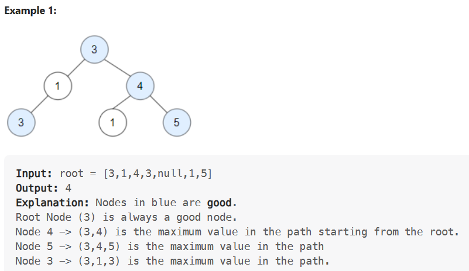
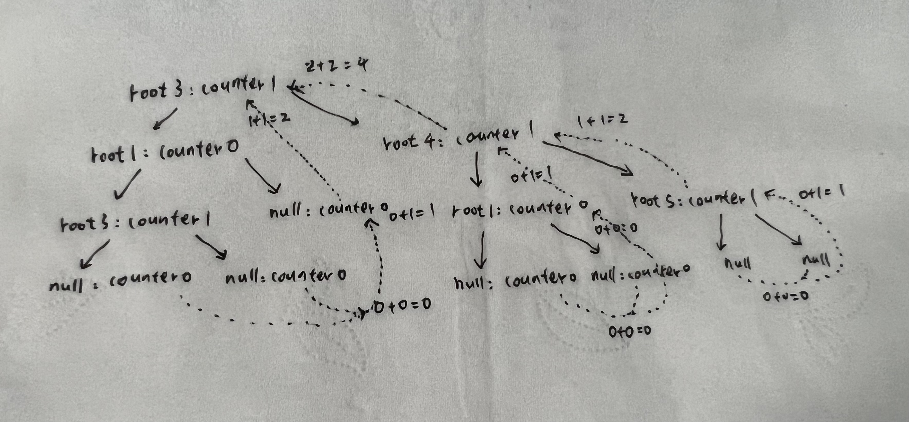

## 206-ReverseLinkedList
#### 
A nice explanation from comments
```
Assume we have LinkedList 1 -> 2 -> 3 -> 4 -> 5 ,
let's assume we already have a recursive function which already reverses LinkedList and we are processing node 2.

We have two LinkedLists first one 1 -> 2 -> 3 -> NULL and reversed 5 -> 4 -> 3 -> NULL .

We want to make that 1 -> 2 -> 3 -> NULL pointer will become 1 -> 2 -> NULL and
reversed list 5 -> 4 -> 3 -> NULL will become 5 -> 4 -> 3 -> 2 -> NULL.

by doing head.next.next = head we are kind of creating cycle to reverse direction,
head is 2
head.next is 3
3.next right now NULL -> becoming head 3 -> 2

first list will become 1 -> 2 -> 3 -> 2 -> 3 -> 2 -> 3 ....
reversed list will become 5 -> 4 -> 3 -> 2 -> 3 -> 2 -> 3 -> 2 ....

by doing head.next = null we are cutting this cycle,

so first list will become 1 -> 2 -> NULL
reversed will become 5 -> 4 -> 3 -> 2 -> NULL
```
## 1448. Count Good Nodes in Binary Tree
#### 第一种递归解法的思路

